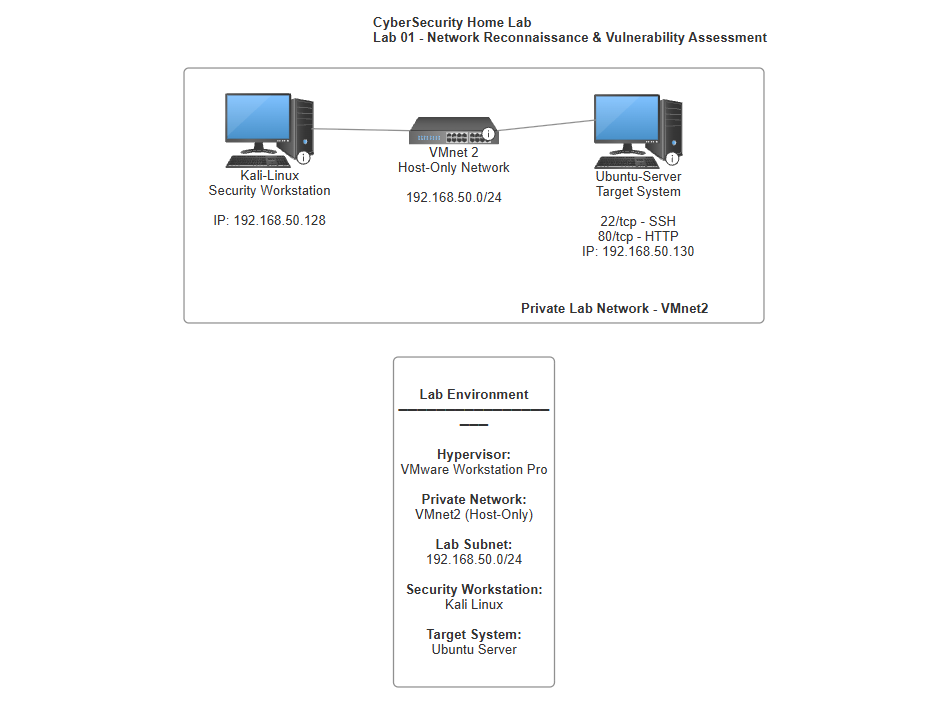

# CyberSecurity Home Lab

## Overview

This repository documents my practical cybersecurity home lab built using VMware Workstation Pro.

The environment provides an isolated platform for developing and demonstrating hands-on skills in network reconnaissance, vulnerability assessment, system hardening, security monitoring and defensive security.

Rather than focusing only on automated tools, the labs document the complete security assessment process, including manual validation of findings, remediation and post-remediation verification.

---

## Lab Environment

The core environment currently consists of:

| Component | Purpose |
|---|---|
| VMware Workstation Pro | Virtualisation platform |
| Kali Linux | Security assessment workstation |
| Ubuntu Server | Target and server environment |
| VMnet2 | Isolated host-only lab network |
| `192.168.50.0/24` | Private lab subnet |

Additional systems and security tools may be introduced as the lab develops.

---

## Network Architecture



The current environment uses an isolated VMware host-only network to allow security testing between virtual machines without targeting external systems.

---

## Labs

### Lab 01 — Network Reconnaissance & Vulnerability Assessment

The first lab performs a structured security assessment against an Ubuntu Server from a Kali Linux workstation.

The assessment includes:

- Network and connectivity verification
- Host discovery
- TCP port scanning
- Service and version enumeration
- HTTP enumeration
- Automated vulnerability assessment
- Manual validation of scanner findings
- Apache security hardening
- Post-remediation verification
- SSH configuration assessment
- Host firewall assessment
- Final service enumeration

Key tools used include **Nmap, Nikto, curl, Apache, OpenSSH and UFW**.

The lab demonstrates a complete assessment workflow:

```text
Discovery
    ↓
Enumeration
    ↓
Vulnerability Assessment
    ↓
Manual Validation
    ↓
Remediation
    ↓
Verification
```

[View Lab 01 — Network Reconnaissance & Vulnerability Assessment](labs/lab-01-network-vulnerability-assessment/README.md)

---

## Skills Demonstrated

Through this project I am developing practical experience with:

- Linux administration
- VMware virtualisation
- Virtual network configuration
- Network reconnaissance
- Nmap scanning and enumeration
- Nmap Scripting Engine
- HTTP enumeration
- Vulnerability assessment
- Manual vulnerability validation
- Apache web server security
- HTTP security headers
- SSH security assessment
- Host-based firewall configuration
- Security hardening
- Remediation verification
- Technical security documentation

---

## Repository Structure

```text
CyberSecurity-Home-Lab/
│
├── README.md
├── docs/
│
└── labs/
    └── lab-01-network-vulnerability-assessment/
        ├── README.md
        ├── diagrams/
        │   └── network-architecture.png
        ├── evidence/
        │   ├── http-headers.txt
        │   ├── http-headers-after.txt
        │   ├── nikto-scan.txt
        │   ├── nikto-scan-after.txt
        │   └── nmap-final.txt
        └── screenshots/
            ├── 01-kali-ip-address.png
            ├── 02-ubuntu-ip-address.png
            ├── ...
            └── 15-final-nmap-scan.png
```

---

## Project Goals

This project is intended to provide a continually developing environment for practical cybersecurity training.

Future labs will expand the environment into areas such as:

- Network traffic analysis
- Intrusion detection
- Centralised logging
- SIEM monitoring
- Vulnerability management
- Linux system hardening
- Web application security
- Attack detection and investigation
- Incident response

Each lab will document the methodology used, evidence collected, findings identified and security controls implemented.