# Lab 01 — Network Reconnaissance & Vulnerability Assessment

## Overview

This lab documents a network reconnaissance and vulnerability assessment performed against an Ubuntu Server within an isolated VMware Workstation home-lab environment.

Kali Linux was used as the security assessment workstation, while Ubuntu Server was used as the target system.

The assessment followed a structured process of host discovery, port scanning, service enumeration, web server assessment, vulnerability scanning, manual validation, remediation, and post-remediation verification.

The purpose of the lab was not simply to identify scanner findings, but to investigate whether findings could be manually validated and to verify that implemented security controls successfully reduced the target's exposed attack surface.

## Objectives

The objectives of this lab were to:

- Identify active systems on the lab network.
- Discover exposed TCP services on the Ubuntu Server.
- Enumerate the software running on discovered services.
- Assess the Apache HTTP service for security weaknesses.
- Validate automated vulnerability scanner findings manually.
- Review the SSH security configuration.
- Review host-based firewall controls.
- Apply appropriate Apache hardening measures.
- Perform post-remediation scanning to verify the effectiveness of the changes.
- Preserve assessment evidence for documentation and comparison.

## Lab Environment

| Component | Configuration |
|---|---|
| Hypervisor | VMware Workstation Pro |
| Security Workstation | Kali Linux |
| Kali IP Address | 192.168.50.128 |
| Target | Ubuntu Server |
| Target IP Address | 192.168.50.130 |
| Lab Subnet | 192.168.50.0/24 |
| Private Network | VMnet2 |
| NAT Network | VMnet3 |

## Tools Used

- Nmap
- Nmap Scripting Engine (NSE)
- Nikto
- curl
- Apache HTTP Server
- OpenSSH
- UFW
- VMware Workstation Pro

## Scope

The assessment was limited to the Ubuntu Server at:

`192.168.50.130`

Testing was performed entirely within an isolated home-lab environment owned and controlled by me.

No external systems were targeted.

## Network Architecture

                 VMware Workstation Pro

        ┌───────────────────────┐
        │                                │
        │       Private Lab Network      │
        │            VMnet2              │
        │                                │
        │   Kali Linux     Ubuntu Server │
        │  192.168.50.128  192.168.50.130│
        │        │               │      │
        │        └───────────┘      │
        │                                │
        └───────────────────────┘
                  

## Methodology

The assessment was divided into the following stages:

1. Network and connectivity verification
2. Host discovery
3. TCP port scanning
4. Service and version enumeration
5. HTTP enumeration
6. Automated vulnerability assessment
7. Manual validation of scanner findings
8. Apache configuration review and hardening
9. Post-remediation verification
10. SSH configuration assessment
11. Host firewall assessment
12. Final service enumeration

# Assessment

## 1. Network and Connectivity Verification

Before beginning the assessment, the network configuration of both virtual machines was verified to confirm that the security workstation and target system were connected to the same private lab network.

The Kali Linux security workstation was assigned:

- **IP Address:** `192.168.50.128`
- **Network:** `192.168.50.0/24`
- **Interface:** `eth0`

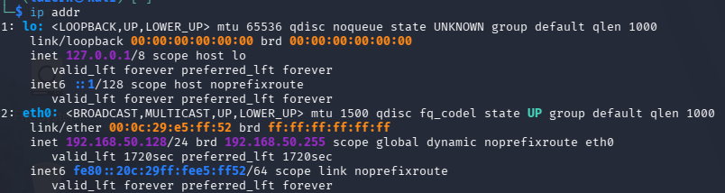

The Ubuntu Server target was assigned:

- **IP Address:** `192.168.50.130`
- **Network:** `192.168.50.0/24`
- **Interface:** `ens33`

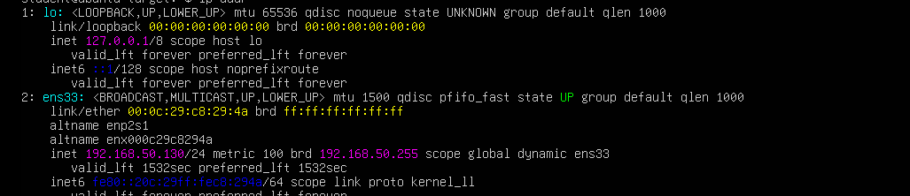

Connectivity from Kali Linux to the Ubuntu Server was then tested using:

```bash
ping -c 4 192.168.50.130
```

The target responded successfully to all four ICMP echo requests with **0% packet loss**, confirming communication between the two virtual machines over the private VMnet2 network.

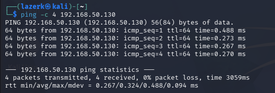

### Result

Network connectivity between the Kali Linux assessment workstation and Ubuntu Server target was successfully verified. Both systems were operating on the `192.168.50.0/24` private lab network.

---

## 2. Host Discovery

After verifying connectivity between the two systems, host discovery was performed to identify active devices on the private lab network.

The following Nmap ping scan was used:

```bash
sudo nmap -sn 192.168.50.0/24
```

The `-sn` option performs host discovery without conducting a port scan. This allowed active hosts on the `192.168.50.0/24` subnet to be identified before performing more detailed enumeration.

The scan identified **four active hosts** on the subnet, including the Ubuntu Server at:

```text
192.168.50.130
```

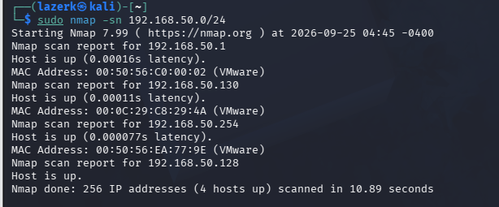

The Ubuntu Server was successfully detected as an active system and was selected as the target for the remainder of the assessment.

### Result

Host discovery successfully identified the Ubuntu Server at `192.168.50.130` as an active host on the VMnet2 network.

This established the target address for subsequent port scanning and service enumeration.

---

## 3. TCP Port Scanning

After identifying the Ubuntu Server as an active host, a TCP port scan was performed to determine which network services were accessible from the Kali Linux assessment workstation.

The following command was used:

```bash
sudo nmap 192.168.50.130
```

Nmap identified two open TCP ports:

| Port     | State| Service |
|----------|------|---------|
| `22/tcp` | Open |   SSH   |
| `80/tcp` | Open |  HTTP   |

The remaining **998 scanned TCP ports were reported as filtered**.

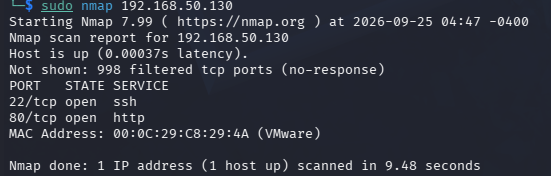

### Analysis

The scan established that the target exposed two network services to the assessment workstation:

- **TCP/22 — SSH:** Used for remote administration of the Ubuntu Server.
- **TCP/80 — HTTP:** Indicated that a web server was accessible over the network.

The `filtered` status of the remaining scanned ports indicated that Nmap's probes were being blocked or otherwise prevented from determining whether those ports were open or closed.

This behaviour was investigated later during the host firewall assessment.

The two identified services, SSH and HTTP, were selected for further enumeration to determine the software and versions running behind them.

### Result

The initial port scan identified a limited externally accessible attack surface consisting of:

```text
22/tcp — SSH
80/tcp — HTTP
```

Further service enumeration was required to identify the software providing these services and assess their configuration.

---

## 4. Service and Version Enumeration

After identifying SSH and HTTP as the two accessible services, service and version detection was performed to determine the software running on each port.

The following Nmap command was used:

```bash
sudo nmap -sV -p 22,80 192.168.50.130
```

The `-sV` option enables service version detection, while `-p 22,80` limits the scan to the two ports identified during the previous stage.

The scan produced the following results:

| Port | State | Service | Detected Software |
|---|---|---|---|
| `22/tcp` | Open | SSH | OpenSSH 10.2p1 Ubuntu |
| `80/tcp` | Open | HTTP | Apache httpd 2.4.66 (Ubuntu) |

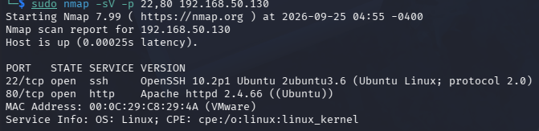

### Analysis

The scan confirmed that the SSH service was provided by **OpenSSH 10.2p1**, while the HTTP service was provided by **Apache HTTP Server 2.4.66**.

Of particular interest was the information disclosed by the HTTP service:

```text
Apache httpd 2.4.66 ((Ubuntu))
```

This revealed both the Apache version and information about the underlying operating system.

Detailed software version information can assist an attacker in researching known vulnerabilities or configuration weaknesses associated with a particular software release.

However, the presence of a version number alone does **not** demonstrate that the service is vulnerable. Further investigation and validation would be required before making a vulnerability determination.

The HTTP service was therefore selected for more detailed enumeration during the next stage of the assessment.

### Result

Service enumeration successfully identified the software associated with both exposed ports:

```text
22/tcp — OpenSSH 10.2p1 Ubuntu
80/tcp — Apache httpd 2.4.66 (Ubuntu)
```

The Apache service's version and operating-system disclosure was recorded for further investigation during the HTTP assessment and subsequent hardening process.

---

## 5. HTTP Enumeration

Following the identification of Apache HTTP Server on TCP port 80, the web service was examined in greater detail to determine what information was exposed to clients.

### Web Page Inspection

The target web server was accessed from the Kali Linux workstation by navigating to:

```text
http://192.168.50.130
```

The server displayed the default **Apache2 Ubuntu Default Page**, confirming that Apache was installed, running and serving HTTP content successfully.

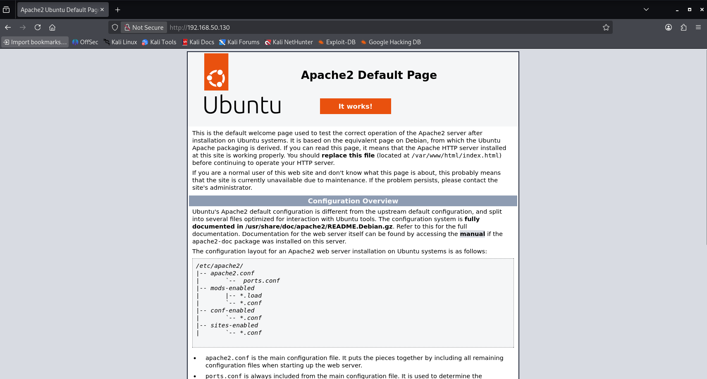

The presence of the default page also provided additional information about the technology running on the target and indicated that the default Apache site remained enabled.

### HTTP Header Inspection

HTTP response headers were then inspected from Kali Linux using:

```bash
curl -I http://192.168.50.130
```

The response included:

```text
HTTP/1.1 200 OK
Server: Apache/2.4.66 (Ubuntu)
Last-Modified: ...
ETag: "29b0-65c3a34765d5f"
Content-Length: 10672
Content-Type: text/html
```

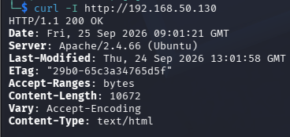

The `Server` header confirmed the information disclosure previously identified through Nmap:

```text
Server: Apache/2.4.66 (Ubuntu)
```

This exposed both the specific Apache version and the underlying Ubuntu platform.

The response also contained an `ETag` header. Its presence was recorded for later investigation because automated vulnerability scanning subsequently raised a potential information-disclosure warning relating to ETags.

At this stage, however, no conclusion was made that the ETag itself represented a confirmed vulnerability.

### Nmap HTTP Enumeration

Additional HTTP enumeration was performed using Nmap's scripting engine:

```bash
sudo nmap -p 80 --script http-title,http-headers 192.168.50.130
```

The scripts identified the Apache default page and returned HTTP header information from the web server.

This provided a second method of observing the information exposed by the HTTP service and supported the results obtained manually with `curl`.

### HTTP Method Enumeration

The HTTP methods accepted by the server were also examined using:

```bash
sudo nmap -p 80 --script http-methods 192.168.50.130
```

The server reported the following supported methods:

```text
GET
POST
OPTIONS
HEAD
```

No unsafe HTTP method finding was established from this enumeration.

The results were therefore treated as service configuration information rather than evidence of a vulnerability.

### Analysis

HTTP enumeration established several important characteristics of the web service:

- Apache was serving the default Ubuntu Apache page.
- Apache disclosed its specific version and operating-system information.
- An ETag was included in HTTP responses.
- The server supported `GET`, `POST`, `OPTIONS` and `HEAD`.
- HTTP header information was accessible for further security analysis.

These observations provided a baseline of the web server's configuration before any security changes were made.

### Result

Manual HTTP enumeration confirmed the Apache version and operating-system information disclosure initially detected by Nmap.

The collected information was retained as **pre-remediation evidence** and used as a baseline for comparison after Apache hardening was performed.

---

## 6. Automated Vulnerability Assessment

Following manual HTTP enumeration, an automated web server assessment was performed using **Nikto**.

Nikto was used to identify potential web server misconfigurations, information disclosure issues and missing security controls.

The following command was executed from Kali Linux:

```bash
nikto -h http://192.168.50.130 -output ~/Lab01/evidence/nikto-scan.txt
```

The `-output` option was used to preserve the scan results as evidence for later comparison with the post-remediation assessment.

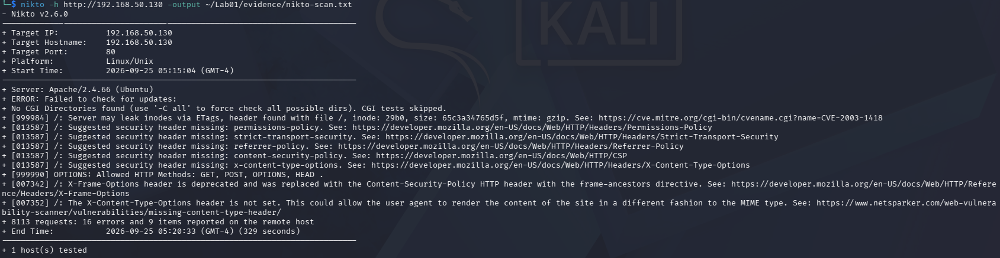

### Initial Findings

The scan identified several potential security issues and configuration observations:

| Finding | Initial Assessment |
|---|---|
| Apache version information exposed | Requires investigation |
| Content-Security-Policy missing | Security hardening opportunity |
| Referrer-Policy missing | Security hardening opportunity |
| Permissions-Policy missing | Security hardening opportunity |
| X-Content-Type-Options missing | Security hardening opportunity |
| Strict-Transport-Security missing | Requires context |
| ETag potentially leaking inode information | Requires manual validation |
| HTTP OPTIONS method available | Requires review |

Nikto also reported that the server was running:

```text
Apache/2.4.66 (Ubuntu)
```

This was consistent with the information previously identified through Nmap and manual HTTP header inspection.

### Missing Security Headers

The scan reported that several HTTP security headers were not present:

```text
Content-Security-Policy
Referrer-Policy
Permissions-Policy
X-Content-Type-Options
Strict-Transport-Security
```

These headers provide different browser-side security controls and can reduce exposure to certain classes of web-based attacks.

Their absence was recorded for configuration review rather than automatically being classified as an exploitable vulnerability.

### ETag Warning

Nikto also reported that the server's ETag configuration could potentially disclose filesystem inode information and referenced:

```text
CVE-2003-1418
```

This finding was **not immediately treated as a confirmed vulnerability**.

Because automated scanners can produce findings that depend on configuration, software version or response behaviour, the ETag value was selected for manual validation during the next stage of the assessment.

### Strict-Transport-Security

Nikto reported that the `Strict-Transport-Security` header was missing.

However, the target was currently providing its web service over HTTP on TCP port 80 rather than HTTPS.

Because HSTS is designed to instruct browsers to access a site using HTTPS, this finding required consideration of the server's current configuration rather than blindly applying the scanner recommendation.

### HTTP Methods

Nikto also observed the following HTTP methods:

```text
GET
POST
OPTIONS
HEAD
```

These results were consistent with the earlier Nmap HTTP method enumeration.

The presence of these methods alone was not treated as evidence of an exploitable vulnerability.

### Analysis

The automated scan identified several areas that warranted further investigation and security hardening.

Importantly, the scanner output was treated as a starting point for analysis rather than a definitive list of confirmed vulnerabilities.

The next stage of the assessment therefore focused on manually validating the reported findings before making configuration changes.

### Result

The initial Nikto assessment identified:

- HTTP security headers that could be added as hardening controls.
- Continued Apache version and platform disclosure.
- A potential ETag information-disclosure issue requiring manual validation.
- An HSTS observation requiring consideration of the HTTP-only configuration.
- HTTP methods requiring review.

The original scan output was retained as pre-remediation evidence for comparison with the results obtained after hardening.

---

## 7. Manual Validation of Scanner Findings

Following the automated vulnerability assessment, selected Nikto findings were manually investigated to determine whether they represented confirmed security issues.

Particular attention was given to the reported **ETag inode information disclosure**, as Nikto referenced CVE-2003-1418.

### ETag Investigation

During the earlier HTTP enumeration, the Apache server returned the following ETag:

```text
ETag: "29b0-65c3a34765d5f"
```

Nikto suggested that the ETag could potentially disclose filesystem inode information.

Before accepting this as a confirmed vulnerability, the Apache configuration and underlying file metadata were examined.

### Apache FileETag Configuration

The Apache configuration was searched for an explicitly configured `FileETag` directive:

```bash
sudo grep -Rni "FileETag" /etc/apache2/
```

No matching configuration was returned.

This indicated that no explicit `FileETag` directive had been configured within `/etc/apache2/`.

Apache build information was also reviewed using:

```bash
apache2ctl -V
```

This confirmed the Apache installation and provided additional server build and configuration information.

### File Metadata Comparison

The metadata of the default Apache page was then inspected:

```bash
stat /var/www/html/index.html
```

The file metadata included:

```text
Size: 10672
Inode: 528276
```

The first component of the observed ETag was:

```text
29b0
```

Converting this hexadecimal value to decimal gives:

```text
0x29b0 = 10672
```

This matched the size of the `index.html` file.

The file's inode value was then converted from decimal to hexadecimal:

```bash
printf "%x\n" 528276
```

The result was:

```text
80f94
```

This value did **not** appear within the observed ETag:

```text
29b0-65c3a34765d5f
```

### Finding Assessment

The investigation demonstrated that part of the ETag corresponded to the file size, but the hexadecimal representation of the file's inode number was not present.

Therefore, the specific inode information disclosure suggested by the automated scanner could **not be validated** in this environment.

The finding was consequently recorded as:

> **Automated finding not validated — no evidence was identified that the observed ETag disclosed the file's inode number.**

This demonstrates the importance of manually validating automated vulnerability scanner results before classifying them as confirmed vulnerabilities.

### Security Header Validation

The HTTP security header findings were also compared against the earlier manual `curl` response.

The initial response did not contain the following headers:

```text
Content-Security-Policy
Referrer-Policy
Permissions-Policy
X-Content-Type-Options
```

Their absence on the tested response was therefore manually confirmed and selected for remediation during the Apache hardening stage.

### HSTS Assessment

The missing `Strict-Transport-Security` header was considered separately.

The web server was operating over:

```text
HTTP — TCP/80
```

and HTTPS had not been configured as part of this lab.

Because HSTS is intended for enforcing HTTPS connections, the header was not added to the HTTP-only service.

The finding was therefore recorded as a future hardening consideration if HTTPS is implemented, rather than a configuration change for the current environment.

### Validation Summary

| Scanner Observation | Manual Validation | Outcome |
|---|---|---|
| Apache version/OS disclosure | Confirmed using Nmap and `curl` | Confirmed |
| Missing Content-Security-Policy | Checked HTTP response | Confirmed |
| Missing Referrer-Policy | Checked HTTP response | Confirmed |
| Missing Permissions-Policy | Checked HTTP response | Confirmed |
| Missing X-Content-Type-Options | Checked HTTP response | Confirmed |
| ETag inode disclosure | Compared ETag with actual inode | Not validated |
| Missing HSTS | Server operating over HTTP only | Deferred until HTTPS |
| HTTP methods | Reviewed GET, POST, OPTIONS and HEAD | No unsafe method finding established |

### Result

Manual validation distinguished confirmed configuration weaknesses from automated observations that were either not demonstrated or not applicable to the current configuration.

Most notably, the potential ETag inode disclosure reported by Nikto was **not reproduced during manual testing**.

The confirmed Apache information disclosure and missing security headers were selected for remediation in the next stage of the assessment.

---

## 8. Apache Configuration Review and Hardening

Following manual validation of the assessment findings, the Apache configuration was reviewed and hardened to reduce unnecessary information disclosure and introduce additional HTTP security controls.

The remediation focused on two areas:

1. Reducing Apache version and operating-system disclosure.
2. Implementing appropriate HTTP security headers.

### Apache Version Disclosure

The Apache security configuration was reviewed using:

```bash
sudo grep -E "ServerTokens|ServerSignature" /etc/apache2/conf-available/security.conf
```

The active configuration contained:

```text
ServerTokens OS
ServerSignature On
```

`ServerTokens OS` allowed Apache to disclose detailed server information, including the Apache version and operating-system platform.

This behaviour had previously been observed in the HTTP response:

```text
Server: Apache/2.4.66 (Ubuntu)
```

The configuration was changed to:

```apache
ServerTokens Prod
ServerSignature Off
```

`ServerTokens Prod` restricts the server response to the product name, while `ServerSignature Off` prevents Apache from adding detailed server signature information to generated pages.

Before applying the configuration, its syntax was validated using:

```bash
sudo apache2ctl configtest
```

The configuration test returned:

```text
Syntax OK
```

Apache was then reloaded:

```bash
sudo systemctl reload apache2
```

The service status was checked to confirm that Apache remained operational:

```bash
sudo systemctl status apache2
```

The service remained:

```text
active (running)
```

### Version Disclosure Verification

The HTTP headers were checked again from Kali Linux:

```bash
curl -I http://192.168.50.130
```

The `Server` header now returned:

```text
Server: Apache
```

instead of:

```text
Server: Apache/2.4.66 (Ubuntu)
```

This confirmed that the Apache version and Ubuntu platform were no longer disclosed through this header.

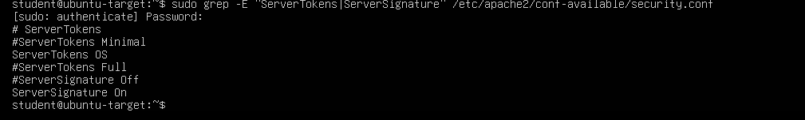

### HTTP Security Headers

The next stage of hardening addressed the missing HTTP security headers identified during the assessment.

Apache's headers module was first checked using:

```bash
apache2ctl -M | grep headers
```

The module was not initially listed, so it was enabled using:

```bash
sudo a2enmod headers
```

The Apache configuration was tested again:

```bash
sudo apache2ctl configtest
```

After receiving:

```text
Syntax OK
```

Apache was restarted and the module was verified:

```bash
apache2ctl -M | grep headers
```

The result confirmed:

```text
headers_module (shared)
```

### Security Header Configuration

A dedicated Apache configuration file was created:

```text
/etc/apache2/conf-available/security-headers.conf
```

The following configuration was added:

```apache
<IfModule mod_headers.c>
    Header always set X-Content-Type-Options "nosniff"
    Header always set Referrer-Policy "strict-origin-when-cross-origin"
    Header always set Content-Security-Policy "default-src 'self'; frame-ancestors 'self'"
    Header always set Permissions-Policy "geolocation=(), microphone=(), camera=()"
</IfModule>
```

The configuration was enabled using:

```bash
sudo a2enconf security-headers
```

Apache's configuration was then validated:

```bash
sudo apache2ctl configtest
```

After confirming:

```text
Syntax OK
```

the Apache service was reloaded:

```bash
sudo systemctl reload apache2
```

### Implemented Security Headers

The following security controls were introduced:

| Header | Purpose |
|---|---|
| `X-Content-Type-Options: nosniff` | Prevents browsers from MIME-sniffing content into a different content type |
| `Referrer-Policy: strict-origin-when-cross-origin` | Controls the amount of referrer information sent to other origins |
| `Content-Security-Policy` | Restricts permitted content sources and controls framing behaviour |
| `Permissions-Policy` | Restricts access to selected browser features |

The configured Content Security Policy was:

```text
default-src 'self'; frame-ancestors 'self'
```

This restricts resources to the same origin by default and prevents other origins from framing the page.

The Permissions Policy disabled access to:

```text
geolocation
microphone
camera
```

These features were unnecessary for the web service used within this lab.

### HSTS Decision

`Strict-Transport-Security` was intentionally not configured.

The web service was operating over HTTP on TCP port 80 and HTTPS had not been implemented within the scope of this lab.

HSTS is intended to instruct browsers to use HTTPS for future connections. Therefore, implementing HTTPS would be required before HSTS could be meaningfully deployed.

This finding was recorded as a future hardening consideration rather than applying a configuration that did not match the current service architecture.

### Result

The Apache hardening process successfully:

- Reduced Apache version and operating-system information disclosure.
- Enabled the Apache headers module.
- Implemented Content-Security-Policy.
- Implemented Referrer-Policy.
- Implemented Permissions-Policy.
- Implemented X-Content-Type-Options.
- Preserved normal operation of the Apache service.

The effectiveness of these changes was then tested independently from the Kali Linux assessment workstation during the post-remediation verification stage.

---

## 9. Post-Remediation Verification

Following the Apache configuration changes, the target was reassessed from the Kali Linux workstation to verify that the implemented controls were functioning as intended.

Testing from the assessment workstation provided independent confirmation that the externally observable behaviour of the web server had changed.

### HTTP Header Verification

The HTTP response headers were inspected again using:

```bash
curl -I http://192.168.50.130
```

The hardened server returned headers including:

```text
HTTP/1.1 200 OK
Server: Apache
X-Content-Type-Options: nosniff
Referrer-Policy: strict-origin-when-cross-origin
Content-Security-Policy: default-src 'self'; frame-ancestors 'self'
Permissions-Policy: geolocation=(), microphone=(), camera=()
```

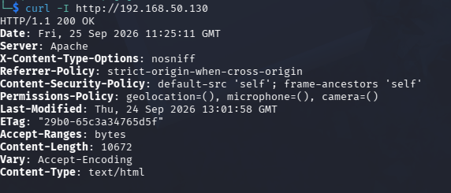

### Before and After Comparison

The HTTP response observed before hardening contained:

```text
Server: Apache/2.4.66 (Ubuntu)
```

After hardening, this was reduced to:

```text
Server: Apache
```

This confirmed that the specific Apache version and Ubuntu platform were no longer disclosed through the `Server` response header.

The following security headers were also now present:

| Security Control | Before | After |
|---|---|---|
| Apache version disclosure | `Apache/2.4.66 (Ubuntu)` | `Apache` |
| Content-Security-Policy | Missing | Present |
| Referrer-Policy | Missing | Present |
| Permissions-Policy | Missing | Present |
| X-Content-Type-Options | Missing | `nosniff` |
| Strict-Transport-Security | Missing | Deferred until HTTPS |

The response continued to contain an ETag. However, the earlier manual investigation did not validate the specific inode information disclosure suggested by the automated scanner.

### Post-Remediation Nikto Scan

Nikto was run again to compare the hardened server against the original assessment:

```bash
nikto -h http://192.168.50.130 -output ~/Lab01/evidence/nikto-scan-after.txt
```

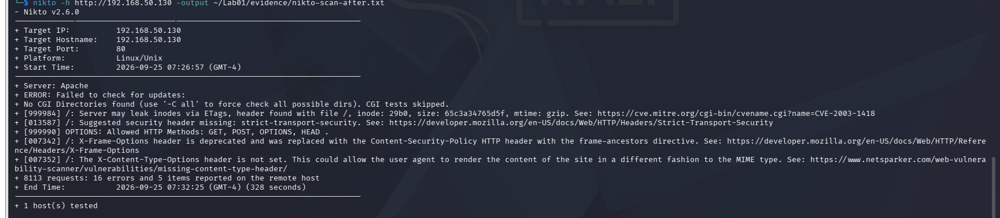

The second scan showed that the server banner had changed from:

```text
Apache/2.4.66 (Ubuntu)
```

to:

```text
Apache
```

Nikto also no longer reported the previously missing:

```text
Content-Security-Policy
Referrer-Policy
Permissions-Policy
```

This provided additional evidence that the Apache hardening changes had taken effect.

### X-Content-Type-Options Scanner Discrepancy

The post-remediation Nikto scan continued to report an observation relating to the `X-Content-Type-Options` header.

However, direct inspection of the root HTTP response using `curl` confirmed:

```text
X-Content-Type-Options: nosniff
```

The manual HTTP response was therefore retained as evidence that the header was successfully configured and returned for the tested `/` resource.

The discrepancy demonstrates why automated scanner results should be compared with direct manual testing rather than being accepted without verification.

### HSTS

Nikto continued to report that `Strict-Transport-Security` was not configured.

This was expected because the web service remained HTTP-only during this lab.

HSTS was therefore not implemented as part of the remediation and remains a future consideration if the service is migrated to HTTPS.

### Verification Result

Post-remediation testing confirmed that the Apache hardening measures successfully changed the externally observable configuration of the target.

The main verified improvements were:

- Apache version and Ubuntu platform information were no longer disclosed through the HTTP `Server` header.
- Content-Security-Policy was successfully implemented.
- Referrer-Policy was successfully implemented.
- Permissions-Policy was successfully implemented.
- X-Content-Type-Options was manually verified as `nosniff`.
- Apache remained operational following the configuration changes.

The post-remediation results demonstrated a measurable improvement compared with the original HTTP configuration while also highlighting the importance of manually validating automated scanner output.

---

## 10. SSH Configuration Assessment

Following the HTTP assessment, the SSH service running on TCP port 22 was reviewed to identify its exposed configuration and authentication controls.

The assessment consisted of remote SSH enumeration from Kali Linux followed by verification of the effective SSH configuration on the Ubuntu Server.

### SSH Algorithm Enumeration

From Kali Linux, Nmap's SSH enumeration script was used:

```bash
sudo nmap -p 22 -sV --script ssh2-enum-algos 192.168.50.130
```

The scan identified the SSH service as:

```text
OpenSSH 10.2p1 Ubuntu
```

The script also enumerated the supported:

- Key exchange algorithms
- Server host key algorithms
- Encryption ciphers
- Message authentication code (MAC) algorithms
- Compression methods

The enumeration provided visibility into the cryptographic capabilities exposed by the SSH service.

The presence of an algorithm in this output was not treated as evidence of a vulnerability by itself.

### Effective SSH Configuration

The effective SSH server configuration was then inspected directly on the Ubuntu Server using:

```bash
sudo sshd -T | grep -E "permitrootlogin|passwordauthentication|pubkeyauthentication|permitemptypasswords|maxauthtries"
```

The following configuration was returned:

```text
maxauthtries 6
permitrootlogin prohibit-password
pubkeyauthentication yes
passwordauthentication yes
permitemptypasswords no
```

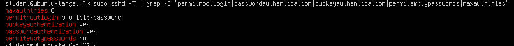

### Configuration Analysis

The effective SSH configuration showed several existing security controls.

| Setting | Value | Assessment |
|---|---|---|
| `PermitRootLogin` | `prohibit-password` | Root password authentication prohibited |
| `PubkeyAuthentication` | `yes` | Public-key authentication enabled |
| `PasswordAuthentication` | `yes` | Password authentication remains available |
| `PermitEmptyPasswords` | `no` | Empty-password authentication prohibited |
| `MaxAuthTries` | `6` | Authentication attempts limited |

The configuration prevents direct root authentication using a password and prevents accounts with empty passwords from authenticating through SSH.

Public-key authentication was also enabled, providing support for stronger key-based authentication.

### Password Authentication

Password authentication remained enabled:

```text
passwordauthentication yes
```

This was recorded as a **hardening opportunity rather than a confirmed vulnerability**.

A more restrictive SSH configuration could disable password authentication and require public-key authentication.

However, password authentication was not disabled during this lab because SSH keys had not yet been configured and tested as the sole authentication method.

Disabling password authentication prematurely could result in administrative lockout from the server.

A future hardening exercise could therefore follow the sequence:

```text
Configure SSH key authentication
        ↓
Verify successful key-based login
        ↓
Disable password authentication
        ↓
Test access again
```

### Root Login

The effective configuration returned:

```text
permitrootlogin prohibit-password
```

This prevents direct root login using password authentication.

The setting was therefore recorded as an existing security control rather than an issue requiring remediation.

### Empty Passwords

The configuration also returned:

```text
permitemptypasswords no
```

This prevents SSH authentication using accounts with empty passwords and was recorded as another positive security control.

### Result

The SSH assessment identified several existing security controls, including:

- Root password authentication was prohibited.
- Public-key authentication was enabled.
- Empty-password authentication was disabled.
- Authentication attempts were limited.
- Password authentication remained enabled.

No SSH vulnerability was established solely from the configuration reviewed during this assessment.

Password authentication was retained for the current lab but identified as an opportunity for future hardening once key-based authentication has been configured and verified.

---

## 11. Host Firewall Assessment

The Ubuntu Server's host-based firewall configuration was reviewed to determine which network services were explicitly permitted and whether inbound traffic was restricted by default.

Ubuntu's Uncomplicated Firewall (UFW) configuration was inspected using:

```bash
sudo ufw status verbose
```

The firewall was active and configured with the following default policies:

```text
Status: active
Logging: on (low)
Default: deny (incoming), allow (outgoing), disabled (routed)
```

The firewall contained rules permitting inbound access to SSH and HTTP:

```text
22/tcp    ALLOW IN    Anywhere
80/tcp    ALLOW IN    Anywhere
```

Equivalent IPv6 rules were also present.

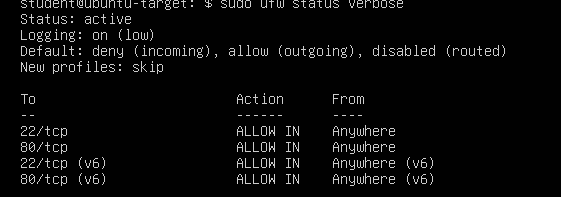

### Firewall Analysis

The most significant control identified was:

```text
Default: deny (incoming)
```

This means unsolicited inbound connections are denied unless an explicit firewall rule permits them.

Only the services required for the current lab were explicitly allowed:

| Port | Service | Firewall Rule |
|---|---|---|
| `22/tcp` | SSH | Allow |
| `80/tcp` | HTTP | Allow |
| Other inbound ports | — | Denied by default |

This configuration follows a restrictive approach in which required services are permitted while other unsolicited inbound traffic is blocked.

### Correlation with Nmap Results

During the earlier TCP port scan, Nmap reported:

```text
22/tcp open ssh
80/tcp open http
998 filtered tcp ports
```

The later firewall assessment showed that UFW permitted inbound traffic to TCP ports 22 and 80 while applying a default deny policy to other inbound connections.

This firewall configuration was **consistent with the behaviour observed during the earlier Nmap scan**, where SSH and HTTP were reachable and the remaining scanned ports were reported as filtered.

### Logging

UFW logging was enabled at:

```text
Logging: on (low)
```

This provides basic firewall logging that can assist with monitoring and troubleshooting network activity.

Reviewing and analysing firewall logs was outside the scope of this assessment but could be incorporated into a future monitoring or incident-detection lab.

### Result

The host firewall was active and appropriately restricted inbound access to the services required for the lab.

The assessment confirmed:

- UFW was enabled.
- Incoming connections were denied by default.
- Outgoing connections were allowed by default.
- SSH on TCP port 22 was explicitly permitted.
- HTTP on TCP port 80 was explicitly permitted.
- Firewall logging was enabled.
- The firewall configuration was consistent with the filtered ports observed during Nmap scanning.

No firewall configuration change was required for the current scope of the lab.

---

## 12. Final Service Enumeration

After completing the configuration review, remediation and verification activities, a final Nmap service scan was performed from the Kali Linux workstation.

The purpose of this scan was to confirm that the required services remained accessible and to determine what service information was externally visible after hardening.

The following command was used:

```bash
sudo nmap -sV 192.168.50.130
```

The final scan identified:

```text
22/tcp open ssh  OpenSSH 10.2p1 Ubuntu
80/tcp open http Apache httpd
```

The remaining 998 scanned TCP ports were reported as filtered.

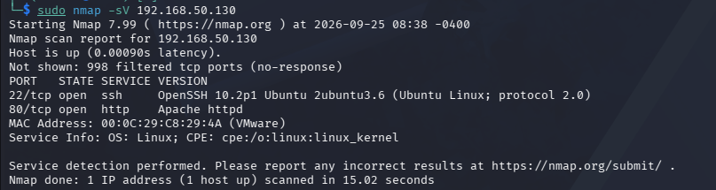

### Comparison with Initial Enumeration

During the initial service enumeration, Nmap identified the HTTP service as:

```text
Apache httpd 2.4.66 ((Ubuntu))
```

Following the Apache hardening changes, the final scan identified the service as:

```text
Apache httpd
```

This demonstrated that the specific Apache version and Ubuntu platform were no longer exposed through the information Nmap obtained from the HTTP service.

The SSH service remained accessible on TCP port 22, while Apache remained accessible on TCP port 80.

| Service | Initial Enumeration | Final Enumeration |
|---|---|---|
| SSH | OpenSSH 10.2p1 Ubuntu | OpenSSH 10.2p1 Ubuntu |
| HTTP | Apache httpd 2.4.66 (Ubuntu) | Apache httpd |
| Open ports | 22, 80 | 22, 80 |
| Other scanned ports | 998 filtered | 998 filtered |

### Analysis

The final scan demonstrated that the Apache hardening measures reduced the amount of web server information exposed to a remote system without disrupting the HTTP service.

The externally accessible services remained limited to:

```text
22/tcp — SSH
80/tcp — HTTP
```

This was consistent with the intended configuration of the lab and the UFW firewall rules reviewed during the previous stage.

The continued visibility of the OpenSSH version was recorded as an observation. No additional SSH remediation was performed within the scope of this assessment.

### Result

Final service enumeration confirmed that:

- SSH remained operational on TCP port 22.
- HTTP remained operational on TCP port 80.
- Apache's specific version and Ubuntu platform were no longer identified during the final Nmap scan.
- No additional open TCP services were discovered.
- The remaining scanned ports continued to appear as filtered.

The final scan provided confirmation that the implemented Apache hardening measures reduced information disclosure while maintaining the availability of the required lab services.

---

# Findings Summary

The assessment identified a combination of confirmed configuration weaknesses, informational observations and opportunities for further hardening.

Automated scanner results were manually reviewed where appropriate before being classified as confirmed findings.

| Finding | Initial State | Action Taken | Final Status |
|---|---|---|---|
| Apache version and OS disclosure | `Apache/2.4.66 (Ubuntu)` exposed | Configured `ServerTokens Prod` and `ServerSignature Off` | **Remediated** |
| Missing Content-Security-Policy | Header absent | Added CSP through `mod_headers` | **Remediated** |
| Missing Referrer-Policy | Header absent | Added `strict-origin-when-cross-origin` | **Remediated** |
| Missing Permissions-Policy | Header absent | Disabled unnecessary browser features | **Remediated** |
| Missing X-Content-Type-Options | Header absent | Added `nosniff` | **Remediated / Manually Verified** |
| Potential ETag inode disclosure | Flagged by Nikto | Compared ETag with actual file metadata | **Not Validated** |
| Missing Strict-Transport-Security | Flagged by Nikto | Reviewed applicability to HTTP-only service | **Deferred Until HTTPS** |
| HTTP methods | `GET`, `POST`, `OPTIONS`, `HEAD` | Reviewed exposed methods | **No Unsafe Method Finding Established** |
| SSH password authentication | Enabled | Configuration reviewed | **Hardening Opportunity** |
| SSH root password authentication | Prohibited | No change required | **Existing Security Control** |
| SSH empty passwords | Disabled | No change required | **Existing Security Control** |
| UFW host firewall | Active with default deny incoming | Configuration reviewed | **Existing Security Control** |
| Exposed network services | TCP 22 and 80 | Verified against intended configuration | **Expected / Intentional** |

## Remediation Summary

The primary remediation work focused on the Apache HTTP service.

Before hardening, the server disclosed:

```text
Server: Apache/2.4.66 (Ubuntu)
```

After remediation, this was reduced to:

```text
Server: Apache
```

Additional HTTP security headers were also implemented:

```text
X-Content-Type-Options: nosniff
Referrer-Policy: strict-origin-when-cross-origin
Content-Security-Policy: default-src 'self'; frame-ancestors 'self'
Permissions-Policy: geolocation=(), microphone=(), camera=()
```

Post-remediation testing using both `curl` and Nmap confirmed that the Apache configuration changes had altered the information exposed to remote clients while preserving availability of the HTTP service.

---

# Conclusion

This lab demonstrated a structured network reconnaissance and vulnerability assessment against an Ubuntu Server within an isolated VMware Workstation Pro environment.

The assessment began with network verification and host discovery before progressing through port scanning, service enumeration, HTTP analysis and automated vulnerability scanning.

Rather than treating automated scanner output as definitive evidence of vulnerabilities, selected findings were manually investigated. This was particularly important for the ETag warning identified by Nikto. Manual comparison of the observed ETag with the actual filesystem inode did not reproduce the suggested inode disclosure, so the finding was recorded as not validated rather than incorrectly classified as a confirmed vulnerability.

Confirmed Apache configuration weaknesses were subsequently addressed. Detailed Apache version and operating-system information was reduced, and several HTTP security headers were introduced.

Post-remediation testing demonstrated that the changes were externally observable and that the Apache service continued to operate normally.

The SSH and UFW configurations were also reviewed. Existing controls included prohibited root password authentication, disabled empty-password authentication, an active host firewall and a default-deny inbound firewall policy. SSH password authentication remained enabled and was identified as an opportunity for future hardening after key-based authentication has been configured and tested.

Overall, the lab demonstrated the complete assessment cycle:

```text
Discovery
    ↓
Enumeration
    ↓
Automated Assessment
    ↓
Manual Validation
    ↓
Remediation
    ↓
Verification
```

The exercise reinforced the importance of combining automated security tools with manual investigation and validating remediation from the perspective of a remote system.

---

# Skills Demonstrated

This lab provided practical experience in the following areas:

- VMware Workstation Pro virtual network configuration
- Isolated host-only network design
- Linux network configuration and troubleshooting
- ICMP connectivity testing
- Network host discovery
- TCP port scanning
- Service and version enumeration
- Nmap Scripting Engine (NSE)
- HTTP service enumeration
- HTTP response header analysis
- Web server vulnerability scanning with Nikto
- Manual validation of automated scanner findings
- Apache HTTP Server configuration
- Apache information-disclosure hardening
- HTTP security header implementation
- Post-remediation security testing
- OpenSSH configuration assessment
- SSH algorithm enumeration
- UFW firewall configuration assessment
- Security finding classification
- Evidence collection and documentation

---

# Evidence and Supporting Files

Evidence collected throughout the assessment was retained to support the findings and demonstrate the before-and-after state of the target.

## Screenshots

| File | Description |
|---|---|
| `01-kali-ip-address.png` | Kali Linux network configuration |
| `02-ubuntu-ip-address.png` | Ubuntu Server network configuration |
| `03-connectivity-test.png` | Kali-to-Ubuntu connectivity verification |
| `04-host-discovery.png` | Nmap subnet host discovery |
| `05-initial-port-scan.png` | Initial TCP port scan |
| `06-service-enumeration.png` | Initial service and version enumeration |
| `07-apache-default-page.png` | Apache default web page |
| `08-http-headers-before.png` | HTTP headers before hardening |
| `09-nikto-before.png` | Initial Nikto vulnerability assessment |
| `10-apache-config-before.png` | Apache configuration before hardening |
| `11-http-headers-after.png` | HTTP headers after hardening |
| `12-nikto-after.png` | Post-remediation Nikto assessment |
| `13-ssh-configuration.png` | SSH configuration assessment |
| `14-ufw-firewall.png` | UFW firewall configuration |
| `15-final-nmap-scan.png` | Final Nmap service enumeration |

## Raw Evidence

Where available, command output was also retained within the `evidence/` directory.

Examples include:

```text
http-headers.txt
http-headers-after.txt
nikto-scan.txt
nikto-scan-after.txt
nmap-final.txt
```

Retaining raw scan output alongside screenshots allows the assessment results to be reviewed without relying solely on images.

---

# Future Improvements

The following activities could extend the lab in future exercises:

- Configure SSH public-key authentication and verify key-based access.
- Disable SSH password authentication after key authentication has been tested.
- Configure HTTPS for the Apache service.
- Implement HSTS after HTTPS has been correctly deployed.
- Replace the default Apache page with a custom test application.
- Review and analyse UFW and system authentication logs.
- Introduce centralised security monitoring and log collection.
- Perform additional authenticated vulnerability assessment.